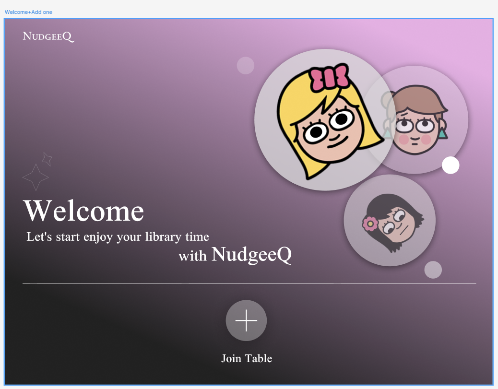

#### 说明 · image-20251012201752472
- 功能概述：应用欢迎页与引导入口，强调品牌 NudgeeQ，提供开始加入桌位的主操作。
- 关键 UI 元素与布局：左侧品牌与欢迎文案，中部/右上装饰头像气泡；底部居中圆形 `+` CTA；下方文案“Join Table”。
- 主要交互与状态：点击 `+` 或“Join Table”进入席位选择；若无网络/服务异常，应直接告警并阻止继续。
- 典型用户路径：Welcome → Join Table。
- 边界/错误与空态：网络不可用、服务不可用时的阻断提示；无需登录态时可匿名进入。
- 与其他页面关系：进入 `SeatSelect`；可通过系统返回退出应用。
- 页面命名建议：Welcome

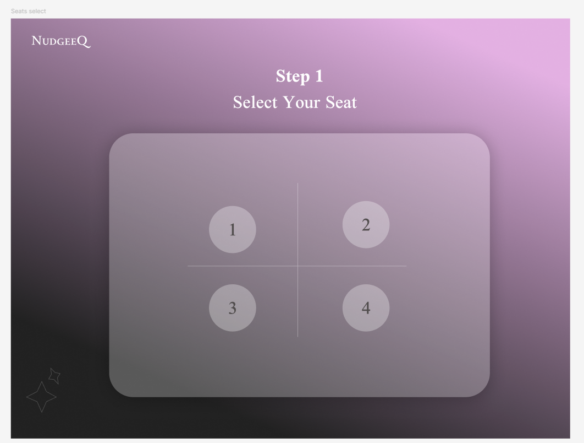

#### 说明 · image-20251012201803341
- 功能概述：Step 1 选择座位/桌位。展示 2×2 网格，编号 1-4。
- 关键 UI 元素与布局：顶部标题“Step 1 / Select Your Seat”；中央卡片内四枚圆形席位按钮与十字分隔。
- 主要交互与状态：点选某一席位即选中；占用席位需禁用或提示“席位已满”。
- 典型用户路径：SeatSelect → StatusSelect。
- 边界/错误与空态：获取座位状态失败时应显示可重试提示；无可用席位时引导返回或加入候补。
- 与其他页面关系：来自 `Welcome`；下一步至 `StatusSelect`。
- 页面命名建议：SeatSelect

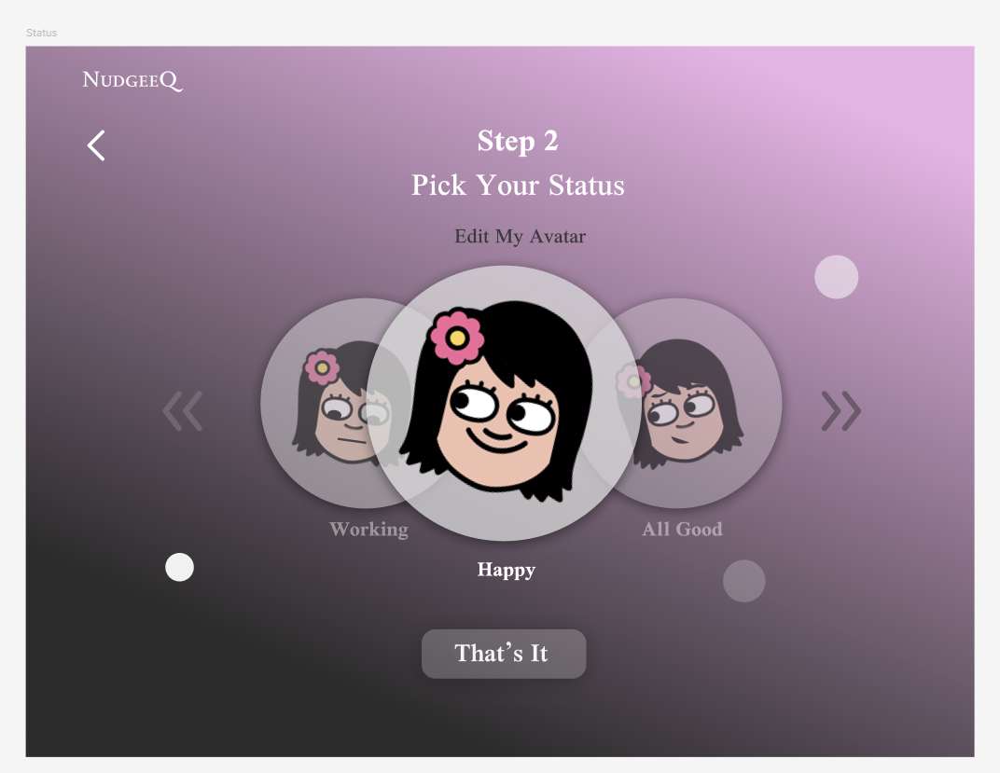

#### 说明 · image-20251012201810531
- 功能概述：Step 2 选择当前状态并可编辑头像。
- 关键 UI 元素与布局：标题“Pick Your Status”；上方头像轮播；下方状态标签（Working/Happy/All Good）；底部确认按钮“That’s It”。
- 主要交互与状态：左右切换头像或状态；点击“Edit My Avatar”进入头像编辑；确认后保存到会话。
- 典型用户路径：StatusSelect → Signal。
- 边界/错误与空态：未选择状态时禁用确认；保存失败时显式错误并保留选择。
- 与其他页面关系：可跳转 `Avatar`；完成后到 `Signal`。
- 页面命名建议：StatusSelect

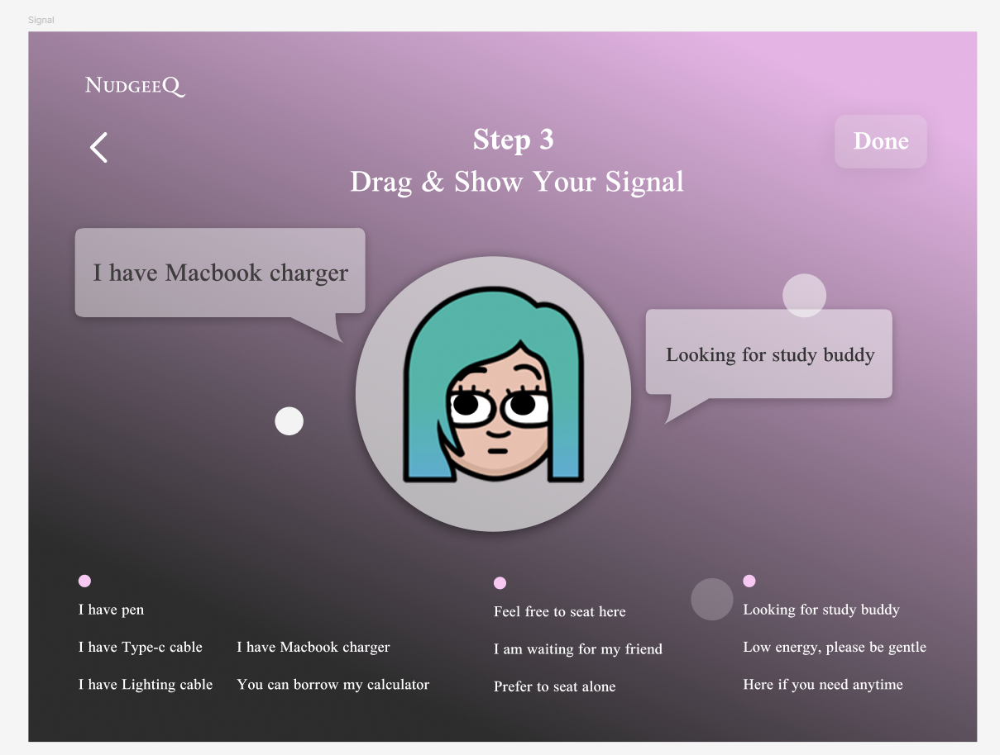

#### 说明 · image-20251012201819075
- 功能概述：Step 3 拖拽选择“Signal”气泡，向他人展示可提供/需要的帮助信息。
- 关键 UI 元素与布局：中央大头像；两侧弹出对话气泡；右上“Done”；底部短语库（如 Charging/Study buddy/Quiet 等）。
- 主要交互与状态：从底部将短语拖拽到头像周边形成贴靠气泡；可多选/删除；完成后点击“Done”。
- 典型用户路径：Signal → Table。
- 边界/错误与空态：短语库存取失败时允许输入自定义；过多气泡时应自动排版或限制数量。
- 与其他页面关系：来自 `StatusSelect`；完成后进入 `Table`；从 `Table` 的 Edit Signal 可回到此处。
- 页面命名建议：Signal

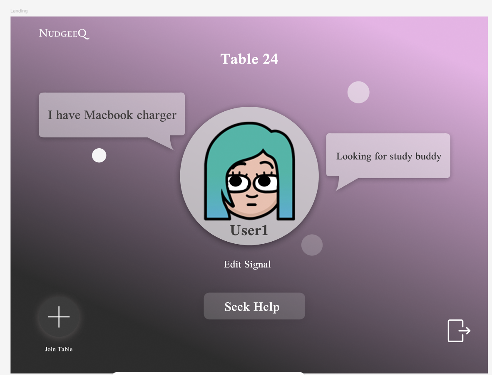

#### 说明 · image-20251012201826655
- 功能概述：个人所处桌位的落地页（单人态）。展示当前头像与已发布的两侧 Signal。
- 关键 UI 元素与布局：标题“Table 24”；头像与昵称；“Edit Signal”“Seek Help”按钮；左下“Join Table”快捷入口。
- 主要交互与状态：编辑信号回到 `Signal`；“Seek Help”进入附近桌位搜索；可再次加入其他桌位。
- 典型用户路径：Table（单人）→ Seek Help → Nearby。
- 边界/错误与空态：桌号获取失败/变更需提示；信号为空时显示占位并引导编辑。
- 与其他页面关系：来自 `Signal`；去往 `Nearby` 或回到 `Signal`。
- 页面命名建议：Table

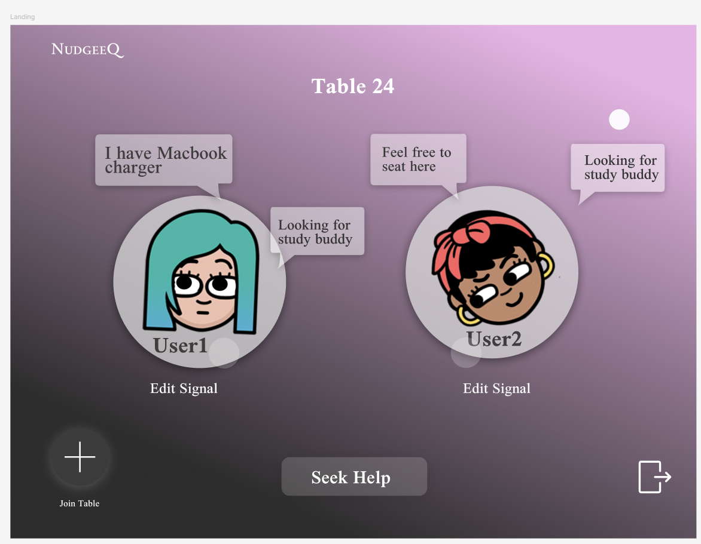

#### 说明 · image-20251012201834197
- 功能概述：桌位多人态展示。显示同桌成员的头像、名字与各自 Signal，支持分别编辑。
- 关键 UI 元素与布局：双头像排布；每人下方“Edit Signal”；底部“Seek Help”；右下离开/外部入口图标。
- 主要交互与状态：可对本人的信号编辑；点击他人不应编辑，仅查看。
- 典型用户路径：Table（多人）↔ Signal；或转到 Nearby 寻求帮助。
- 边界/错误与空态：成员动态加入/离开时需实时刷新；冲突编辑需提示。
- 与其他页面关系：与单人版 `Table` 为同路由不同态。
- 页面命名建议：Table（多人态）

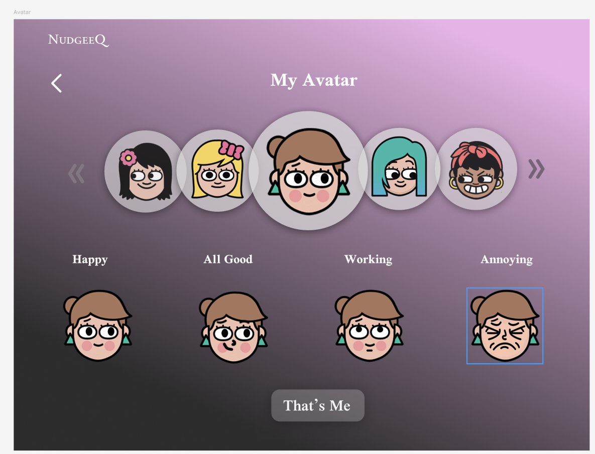

#### 说明 · image-20251012201842154
- 功能概述：头像库与表情状态管理页。
- 关键 UI 元素与布局：顶部“My Avatar”；中部头像轮播；底部四个状态示例（Happy/All Good/Working/Annoying）；“That’s Me”确认。
- 主要交互与状态：挑选头像样式与状态；确认后回写到用户会话/状态。
- 典型用户路径：Avatar → 返回 StatusSelect。
- 边界/错误与空态：保存失败时保留本地选择并提示重试。
- 与其他页面关系：由 `StatusSelect` 的“Edit My Avatar”进入；也可从个人中心入口进入（若存在）。
- 页面命名建议：Avatar

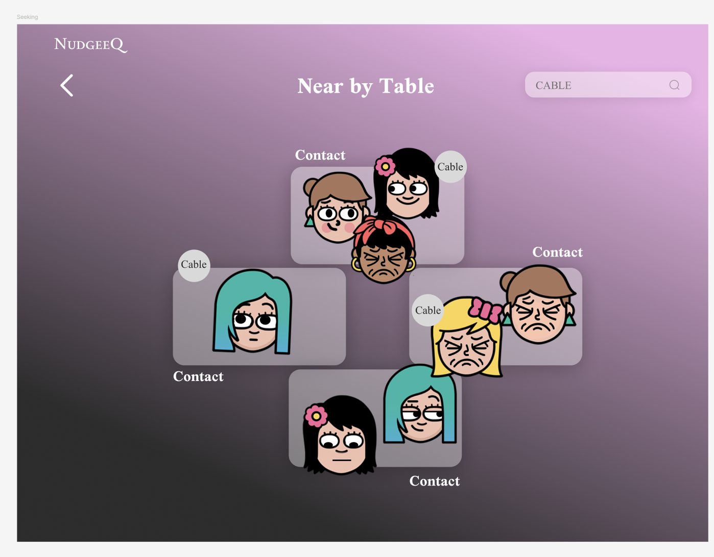

#### 说明 · image-20251012201856569
- 功能概述：附近桌位检索与发现，支持按需求关键词快速筛选（例：CABLE）。
- 关键 UI 元素与布局：标题“Near by Table”；右上搜索输入；多张桌位卡片包含成员与标签“Contact/Cable”。
- 主要交互与状态：输入关键字过滤；点选某张桌卡进入消息页以发送请求。
- 典型用户路径：Nearby → Notify。
- 边界/错误与空态：无匹配结果时显示空态与热门标签；网络失败可重试。
- 与其他页面关系：从 `Table` 的 Seek Help 进入；选择桌位后到 `Notify`。
- 页面命名建议：Nearby

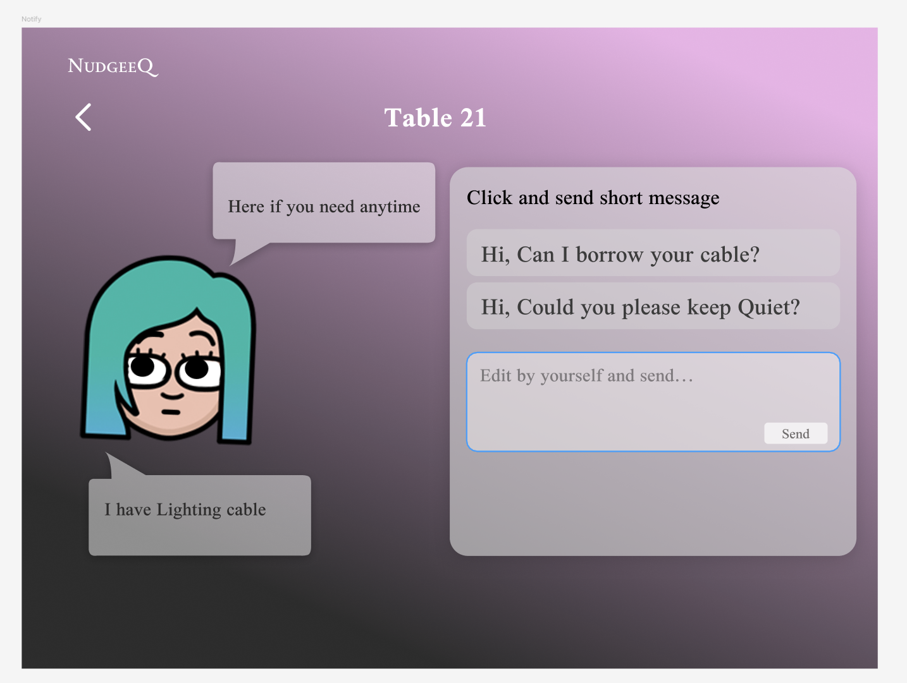

#### 说明 · image-20251012201903739
- 功能概述：向选定桌位快速发送短消息（模板或自定义），如借用充电线、请保持安静等。
- 关键 UI 元素与布局：右侧消息区域含两条快捷短语与输入框；左侧展示我方头像与当前公开 Signal。
- 主要交互与状态：点击模板即发送/或进入确认；自定义输入后“Send”发送。
- 典型用户路径：Notify → 对方 `NotifyPrompt`。
- 边界/错误与空态：发送失败应明确重试/撤回；避免重复轰炸（节流/冷却）。
- 与其他页面关系：来自 `Nearby`；触发对方的 `NotifyPrompt`。
- 页面命名建议：Notify

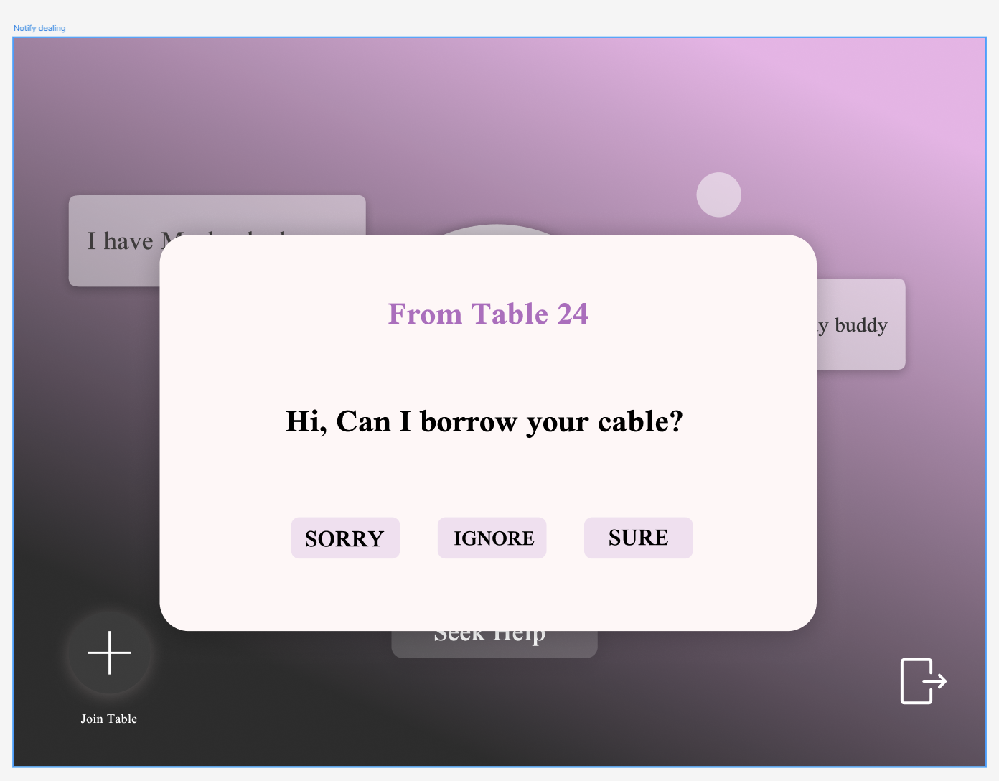

#### 说明 · image-20251012201910831
- 功能概述：接收端弹窗，显示来信来源桌号与请求内容，提供 SORRY/IGNORE/SURE 三选。
- 关键 UI 元素与布局：模态框置顶，居中大标题“From Table xx”；大号消息文案；底部三个操作按钮。
- 主要交互与状态：不同按钮回传不同结果；IGNORE 不反馈但关闭弹窗；SORRY/SURE 反馈到发送端。
- 典型用户路径：NotifyPrompt → 发送端 `NotifyReply`。
- 边界/错误与空态：重复弹窗需去重；超时自动关闭或默认 IGNORE。
- 与其他页面关系：由对方 `Notify` 触发；处理结果通知发送端。
- 页面命名建议：NotifyPrompt

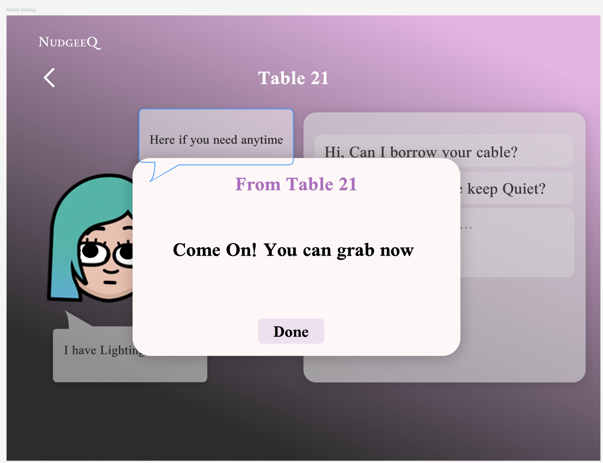

#### 说明 · image-20251012201929352
- 功能概述：发送端回执弹窗，展示对方的处理结果（如同意取用）。
- 关键 UI 元素与布局：模态框标题“From Table 21”；正文给出结果语句；底部“Done”关闭。
- 主要交互与状态：点击 Done 关闭并返回原页面；可考虑将对话追加到桌位会话记录。
- 典型用户路径：NotifyReply → 关闭回到 `Notify` 或 `Table`。
- 边界/错误与空态：若接收端无响应则超时提示；可允许再次尝试或改发其他桌位。
- 与其他页面关系：由 `NotifyPrompt` 的选择触发返回给发送端。
- 页面命名建议：NotifyReply

### 整体逻辑

- 页面清单与命名：
  - Welcome → SeatSelect → StatusSelect → Signal → Table（单/多人态）
  - Avatar（从 StatusSelect 可进）
  - Nearby（Table 的 Seek Help 进入）
  - Notify（向目标桌发送消息）
  - NotifyPrompt（接收端弹窗选择 SORRY/IGNORE/SURE）
  - NotifyReply（发送端接收结果确认）

- 关系说明：
  - 初始从 Welcome 开始，用户依次完成座位选择、状态与头像配置，再设置 Signal 后进入桌位主页。
  - 在桌位页可编辑 Signal，或寻找附近桌位（Nearby）。
  - 从 Nearby 选择目标桌后，进入 Notify 发送短消息；对方收到 NotifyPrompt 并给出反馈；结果以 NotifyReply 返回给发送端。
  - Avatar 为可选分支，用于自定义头像与状态，完成后回到状态选择或当前流程。

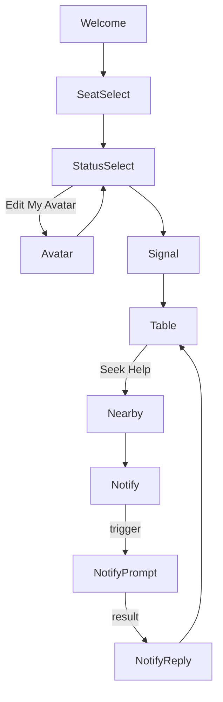